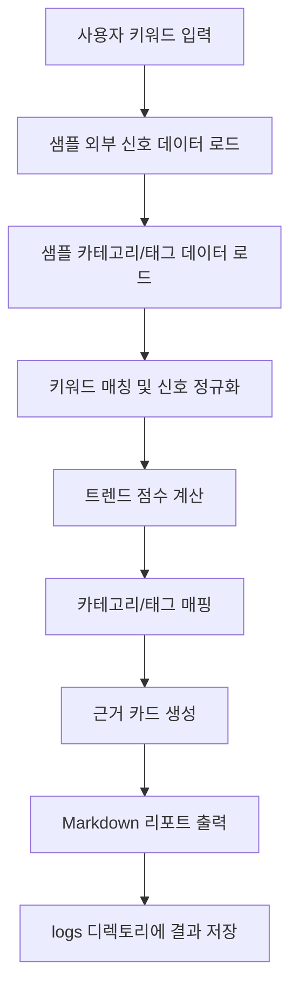

# MUSINSA Trend Signal Validator

무신사의 AI 트렌드 큐레이션이 모자 카테고리에서 패션·뷰티 전 영역으로 확장되기 전, 신규 트렌드 후보를 공개 데이터 기반으로 사전 검증하고 실행 아이디어로 연결하는 Codex 플러그인 MVP입니다.

---

## 1. 프로젝트 개요

**MUSINSA Trend Signal Validator**는 패션·뷰티 트렌드 키워드의 확장 가능성을 검증하는 AX 기반 보조 도구입니다.

무신사는 2026년 6월 뉴스룸을 통해 AI 트렌드 큐레이션을 도입했다고 발표했습니다. 해당 큐레이션은 사용자의 과거 구매 이력이나 클릭 로그에만 의존하지 않고, 플랫폼 외부에서 발생하는 패션·뷰티 관련 실시간 트렌드 변화를 AI가 먼저 포착해 상품과 연결하는 “선제적 큐레이션” 모델을 지향합니다.

다만 현재 공개 자료 기준으로는 캡, 야구모자 등 **모자 카테고리에서 우선 적용**한 뒤, 기술적 완성도와 데이터 정밀도를 검증하고 패션·뷰티 전 영역으로 확대할 계획이라고 설명되어 있습니다.

본 MVP는 이 확장 전 단계에서 사용할 수 있는 보조 도구입니다.
즉, “무신사에 AI 큐레이션이 없다”는 문제를 해결하는 것이 아니라, **이미 추진 중인 AI 큐레이션을 패션·뷰티 전 영역으로 확장하기 전에 신규 트렌드 후보를 공개 데이터와 샘플 상품 데이터 기준으로 빠르게 검증하는 것**을 목표로 합니다.

---

## 2. 해결하려는 문제

무신사가 AI 트렌드 큐레이션을 패션·뷰티 전 영역으로 확장하려면, 신규 트렌드 후보를 지속적으로 발굴하고 검증해야 합니다.

이 과정에서 다음과 같은 반복 업무가 발생할 수 있습니다.

1. **외부 트렌드 신호 확인**

   * YouTube, TikTok, Pinterest, 검색 트렌드, 브랜드 쇼, 룩북 등 여러 채널에서 특정 키워드가 실제로 확산되고 있는지 확인해야 합니다.

2. **트렌드 후보의 우선순위 판단**

   * 어떤 키워드는 검색량은 높지만 상품 연결성이 낮을 수 있습니다.
   * 반대로 특정 키워드는 검색량은 낮아도 이미지·스타일 확산성이 높아 패션·뷰티 큐레이션에 적합할 수 있습니다.

3. **상품·카테고리·태그 연결 가능성 검토**

   * 트렌드 키워드가 실제 무신사 상품 카테고리, 스타일 태그, 기획전 주제, 콘텐츠 소재로 연결될 수 있는지 판단해야 합니다.

4. **담당자별 정성 판단의 편차**

   * MD, 큐레이션 담당자, 콘텐츠 마케터가 각자 다른 기준으로 트렌드를 판단하면 실행 우선순위를 정하기 어렵습니다.

5. **검증 결과를 실행 액션으로 변환**

   * 단순히 “이 키워드가 뜬다”는 정보만으로는 부족합니다.
   * 어떤 카테고리와 연결할지, 어떤 태그를 만들지, 어떤 콘텐츠나 기획전으로 풀어낼지까지 제안되어야 합니다.

본 MVP는 이 문제를 해결하기 위해 트렌드 후보를 입력받고, 샘플 외부 신호 데이터와 샘플 상품·카테고리 데이터를 바탕으로 점수화한 뒤, Markdown 리포트 형태로 근거와 실행 액션을 제공합니다.

---

## 3. 공개 자료 기반 문제 근거

> 본 섹션은 MVP 기획 근거를 설명하기 위한 공개 자료 요약입니다.
> MVP 구현에서는 실제 무신사 내부 데이터, 실제 사용자 데이터, 실제 매출·전환 데이터에 접근하지 않습니다.

### 3.1 무신사 AI 트렌드 큐레이션 도입

무신사는 2026년 6월 3일 뉴스룸에서 AI 트렌드 큐레이션 도입을 발표했습니다.

해당 자료에 따르면 무신사의 AI 트렌드 큐레이션은 다음 방향성을 갖습니다.

* 사용자의 과거 구매 이력이나 클릭 로그 중심의 개인화 추천을 넘어섬
* 플랫폼 외부에서 발생하는 패션·뷰티 관련 실시간 트렌드 변화를 AI가 먼저 포착
* 외부 비정형 트렌드 데이터를 수집·가공
* 트렌드 키워드를 상품 속성과 자동 조합
* 캡, 야구모자 등 모자 카테고리에서 우선 적용
* 기술적 완성도와 데이터 정밀도를 검증한 뒤 패션·뷰티 전 영역으로 확대 계획

출처 URL:

```text
https://newsroom.musinsa.com/newsroom-menu/2026-0603
```

### 3.2 Google Trends 데이터 활용 가능성

Google Search Central은 Google Trends가 집계·익명화·분류된 Google 및 YouTube 검색 샘플을 제공한다고 설명합니다.

본 MVP에서는 실제 Google Trends API를 직접 연동하지 않고, 검색 관심도와 상승률을 모사한 `sample_external_signals.csv` 데이터를 사용합니다.

출처 URL:

```text
https://developers.google.com/search/docs/monitor-debug/trends-start
https://support.google.com/trends/answer/4365533
```

### 3.3 Pinterest 기반 이미지·스타일 트렌드 참고 가능성

Pinterest는 Pinterest Predicts를 통해 소비자 인사이트와 예측 분석을 기반으로 향후 트렌드를 제시한다고 설명합니다.

패션·뷰티 트렌드는 텍스트 검색량뿐 아니라 이미지 저장, 스타일 반복, aesthetic 키워드와도 관련이 있으므로, 본 MVP에서는 Pinterest 계열 신호를 “이미지·스타일 확산성” 점수의 샘플 항목으로 반영합니다.

출처 URL:

```text
https://business.pinterest.com/pinterest-predicts/about/
https://business.pinterest.com/pinterest-predicts/
```

### 3.4 YouTube 기반 영상·콘텐츠 트렌드 참고 가능성

YouTube Culture & Trends는 크리에이터와 영상 문화에서 발생하는 주요 트렌드를 분석하는 리포트 체계를 운영합니다.

본 MVP에서는 실제 YouTube API를 호출하지 않고, 영상 언급량, 조회수 변화, 콘텐츠 등장 빈도를 모사한 샘플 데이터를 사용합니다.

출처 URL:

```text
https://www.youtube.com/trends/
https://www.youtube.com/trends/report/
```

### 3.5 TikTok 기반 숏폼·해시태그 트렌드 참고 가능성

TikTok Creative Center는 TikTok 내 트렌드와 크리에이티브 인사이트를 탐색할 수 있는 공개 페이지를 제공합니다.

본 MVP에서는 실제 TikTok 데이터를 수집하지 않고, 해시태그 확산성, 숏폼 콘텐츠 등장 빈도, 소셜 확산 점수를 샘플 데이터로 구성합니다.

출처 URL:

```text
https://ads.tiktok.com/business/creativecenter/trends/hub/pc/en
https://ads.tiktok.com/creative/creativeCenter/trends
```

### 3.6 본 README에서 제외한 주장

아래 유형의 주장은 예선 제출용 MVP README에서 제외합니다.

* 출처가 불분명한 구매 전환율, CTR, 매출 상승률
* 무신사 내부 데이터 접근을 전제로 하는 수치
* 특정 트렌드가 실제 무신사 매출에 기여했다는 검증되지 않은 주장
* 공개 자료에서 확인되지 않은 정량 수치

필요 시 향후 본선 또는 고도화 단계에서 별도 출처 확인 후 추가합니다.

---

## 4. MVP 플러그인의 사용자

### 4.1 MD

MD는 트렌드 키워드가 실제 상품군과 연결 가능한지 판단하고, 기획전이나 상품 태그로 확장할 수 있는지 검토합니다.

MVP에서 제공하는 도움:

* 트렌드 후보 점수 확인
* 연결 가능한 상품 카테고리 확인
* 추천 태그 확인
* 기획전 아이디어 확인

### 4.2 큐레이션 담당자

큐레이션 담당자는 트렌드 키워드를 사용자에게 보여줄 수 있는 탐색 경험으로 변환합니다.

MVP에서 제공하는 도움:

* 큐레이션 테마 후보 확인
* 스타일 키워드 정리
* 카테고리별 노출 아이디어 확인
* “확장 추천 / 관찰 필요 / 보류” 판단 참고

### 4.3 콘텐츠 마케터

콘텐츠 마케터는 트렌드 키워드를 콘텐츠 주제, 숏폼 소재, 매거진 주제, 캠페인 메시지로 변환합니다.

MVP에서 제공하는 도움:

* 콘텐츠 제목 후보 확인
* 소셜 확산 근거 확인
* 해시태그 후보 확인
* 트렌드 리포트 형태의 Markdown 산출물 활용

---

## 5. MVP 구현 범위

본 프로젝트는 예선 제출용 Codex 플러그인 MVP입니다.
따라서 실제 외부 API, 무신사 내부 데이터, 실시간 크롤링, 대시보드는 MVP 범위에서 제외합니다.

### 5.1 MVP에서 실제 구현할 기능

| 기능              | 설명                                                |
| --------------- | ------------------------------------------------- |
| 키워드 입력          | 사용자가 검증할 패션·뷰티 트렌드 키워드를 입력                        |
| 샘플 외부 신호 데이터 로드 | CSV 또는 JSON 파일에서 검색성, 소셜 확산성, 이미지 확산성 등 샘플 데이터 로드 |
| 트렌드 점수 계산       | 사전 정의한 가중치 기준으로 100점 만점 점수 계산                     |
| 근거 카드 생성        | 왜 해당 키워드를 봐야 하는지 Markdown 근거 카드 생성                |
| 무신사 카테고리/태그 매핑  | sample CSV 또는 사용자가 제공한 카테고리·상품·태그 데이터 기준으로 매핑     |
| Markdown 리포트 출력 | 최종 결과를 `logs/` 또는 지정 경로에 `.md` 파일로 저장             |

### 5.2 MVP에서 사용하지 않는 것

| 제외 항목                                        | 이유                                               |
| -------------------------------------------- | ------------------------------------------------ |
| 실제 무신사 내부 상품 DB                              | 접근 권한이 없으므로 MVP에서는 사용하지 않음                       |
| 실제 사용자 행동 로그                                 | 개인정보 및 내부 데이터 접근 이슈로 제외                          |
| 실제 구매 전환율, CTR, 매출 데이터                       | 내부 데이터 접근이 필요하므로 제외                              |
| 실시간 크롤링                                      | 예선 MVP에서는 안정성과 재현성을 우선                           |
| 실제 Google, YouTube, TikTok, Pinterest API 호출 | API 인증, rate limit, 정책 이슈로 MVP에서는 sample 데이터로 대체 |
| 대시보드 UI                                      | 예선 MVP에서는 Markdown 리포트 출력으로 대체                   |

### 5.3 데이터 대체 방식

MVP에서는 내부 데이터와 외부 API를 다음 방식으로 대체합니다.

| 실제 서비스에서 필요할 수 있는 데이터       | MVP 대체 방식                                             |
| --------------------------- | ----------------------------------------------------- |
| 외부 검색 트렌드                   | `sample_external_signals.csv`                         |
| YouTube/TikTok/Pinterest 신호 | `sample_external_signals.csv`                         |
| 브랜드 쇼·룩북 등장 여부              | `sample_external_signals.csv`의 `brand_show_signal` 컬럼 |
| 무신사 상품 데이터                  | `sample_musinsa_catalog.csv`                          |
| 무신사 카테고리 데이터                | `sample_musinsa_categories.csv`                       |
| 무신사 태그 데이터                  | `sample_musinsa_tags.csv`                             |
| 담당자 피드백                     | `logs/feedback_sample.json` 또는 수동 입력                  |

---

## 6. 주요 기능

### 6.1 키워드 입력

사용자는 검증하고 싶은 트렌드 키워드를 입력합니다.

예시:

```text
볼캡
고프코어 샌들
리본 코어
글로우 립
쿨톤 메이크업
피스타치오 네일
버뮤다 팬츠
러닝 코어
```

### 6.2 샘플 외부 신호 데이터 로드

MVP는 외부 API를 호출하지 않고 샘플 데이터를 로드합니다.

예시 CSV:

```csv
keyword,search_interest,search_growth,social_mentions,social_growth,visual_mentions,visual_growth,brand_show_signal
피스타치오 네일,72,18,64,15,88,24,52
볼캡,86,12,78,10,75,8,67
리본 코어,69,21,82,28,91,31,58
고프코어 샌들,74,16,70,14,77,19,61
```

### 6.3 트렌드 점수 계산

MVP는 아래 가중치를 기준으로 100점 만점의 트렌드 점수를 계산합니다.

| 평가 항목           | 설명                             | 가중치 |
| --------------- | ------------------------------ | --: |
| 검색성             | 검색 관심도와 검색 상승률                 |  20 |
| 소셜 확산성          | 숏폼·영상·소셜 언급량과 상승률              |  20 |
| 이미지·스타일 확산성     | Pinterest, 룩북, 이미지 기반 반복 등장 신호 |  20 |
| 브랜드 쇼 등장 가능성    | 브랜드 쇼, 룩북, 컬렉션 등장 가능성          |  15 |
| 무신사 카테고리/태그 연결성 | 샘플 카테고리·태그·상품 데이터와의 연결 가능성     |  25 |
| 총점              |                                | 100 |

> 위 가중치는 MVP 검증용 초기값입니다.
> 실제 서비스 적용 시에는 담당자 피드백과 성과 데이터 기반으로 조정해야 합니다.

### 6.4 근거 카드 생성

각 키워드에 대해 다음 항목을 포함한 근거 카드를 생성합니다.

* 트렌드 요약
* 주요 점수
* 왜 지금 봐야 하는지
* 강한 신호
* 약한 신호
* 연결 가능한 무신사 카테고리
* 추천 태그
* 실행 액션
* 리스크
* 최종 판단

최종 판단 기준:

|         점수 구간 | 판단    |
| ------------: | ----- |
|        80점 이상 | 확장 추천 |
| 60점 이상 80점 미만 | 관찰 필요 |
|        60점 미만 | 보류    |

### 6.5 무신사 카테고리/태그 매핑

MVP에서는 실제 무신사 내부 DB를 사용하지 않습니다.

대신 아래 중 하나를 사용합니다.

1. 프로젝트에 포함된 sample CSV
2. 사용자가 제공한 상품·카테고리 CSV
3. 사용자가 직접 입력한 카테고리·태그 목록

예시 카테고리 CSV:

```csv
category_id,category_name,domain,keywords
C001,모자,fashion,"볼캡,야구모자,캡,비니"
C002,샌들,fashion,"고프코어 샌들,스포츠 샌들,아웃도어 샌들"
C003,네일,beauty,"피스타치오 네일,여름 네일,파스텔 네일"
C004,립메이크업,beauty,"글로우 립,틴트,립밤"
```

예시 태그 CSV:

```csv
tag,keywords
#볼캡,"볼캡,야구모자,캡"
#고프코어,"고프코어,아웃도어,테크웨어"
#피스타치오네일,"피스타치오 네일,그린 네일,파스텔 네일"
#글로우립,"글로우 립,립틴트,촉촉한 립"
```

---

## 7. 입력/출력 예시

### 7.1 입력 예시

CLI 또는 Codex Plugin Skill에서 다음과 같은 입력을 받습니다.

```json
{
  "keyword": "피스타치오 네일",
  "domain": "beauty",
  "season": "2026_summer",
  "data_source": "sample"
}
```

### 7.2 출력 예시

Markdown 리포트 예시:

```markdown
# Trend Validation Report: 피스타치오 네일

## 1. 최종 판단

- 최종 점수: 82 / 100
- 판단: 확장 추천
- 도메인: beauty

## 2. 점수 상세

| 항목 | 점수 |
|---|---:|
| 검색성 | 17 / 20 |
| 소셜 확산성 | 15 / 20 |
| 이미지·스타일 확산성 | 19 / 20 |
| 브랜드 쇼 등장 가능성 | 11 / 15 |
| 무신사 카테고리/태그 연결성 | 20 / 25 |

## 3. 왜 지금 봐야 하는가

피스타치오 네일은 여름 시즌 컬러 트렌드와 연결하기 쉽고, 네일·메이크업·패션 액세서리 콘텐츠로 확장 가능한 키워드입니다.  
샘플 데이터 기준 이미지·스타일 확산성이 높고, 뷰티 카테고리 내 네일·립·메이크업 상품과 연결 가능성이 있습니다.

## 4. 연결 가능한 카테고리

- 뷰티 > 네일
- 뷰티 > 메이크업
- 패션잡화 > 액세서리

## 5. 추천 태그

- #피스타치오네일
- #파스텔그린
- #여름네일
- #쿨톤메이크업

## 6. 추천 실행 액션

1. 여름 네일 컬러 기획전 후보로 검토
2. 그린·파스텔 계열 뷰티 상품 태그 정비
3. SNS 숏폼 콘텐츠 주제로 활용
4. 네일·립·아이섀도우 상품 묶음 큐레이션 후보로 검토

## 7. 리스크

- 단기 컬러 유행일 수 있으므로 주기적 재검증 필요
- 실제 구매 전환 가능성은 내부 성과 데이터 연동 전까지 판단 불가
- 현재 MVP 결과는 sample CSV 기준이므로 실제 운영 판단에는 담당자 검토 필요
```

---

## 8. 플러그인 작동 흐름



### 8.1 단계별 설명

1. **사용자 키워드 입력**

   * 예: `피스타치오 네일`

2. **샘플 외부 신호 데이터 로드**

   * `sample_external_signals.csv`에서 키워드에 해당하는 신호를 찾습니다.

3. **샘플 카테고리/태그 데이터 로드**

   * `sample_musinsa_categories.csv`
   * `sample_musinsa_tags.csv`
   * `sample_musinsa_catalog.csv`

4. **키워드 매칭**

   * 입력 키워드와 샘플 데이터의 `keyword`, `keywords`, `tag` 값을 비교합니다.

5. **점수 계산**

   * 검색성, 소셜 확산성, 이미지 확산성, 브랜드 쇼 신호, 카테고리/태그 연결성을 계산합니다.

6. **근거 카드 생성**

   * 점수의 이유와 추천 액션을 자연어로 생성합니다.

7. **Markdown 리포트 저장**

   * 결과를 `logs/trend-report-<keyword>.md` 형식으로 저장합니다.

---

## 9. 검증 방법

MVP 검증은 실제 매출이나 전환율이 아니라, **도구가 실무 판단을 보조할 수 있는지**를 기준으로 진행합니다.

### 9.1 기능 검증

| 검증 항목       | 방법                            |
| ----------- | ----------------------------- |
| 키워드 입력 처리   | 정상 키워드, 없는 키워드, 유사 키워드 입력 테스트 |
| 샘플 데이터 로드   | CSV 파일 누락, 컬럼 누락, 빈 값 처리 테스트  |
| 점수 계산       | 동일 입력에 대해 일관된 점수 산출 여부 확인     |
| 카테고리 매핑     | 키워드와 관련 카테고리/태그가 적절히 연결되는지 확인 |
| Markdown 출력 | 결과 파일이 지정 경로에 생성되는지 확인        |

### 9.2 결과 품질 검증

담당자 또는 심사자가 다음 질문에 답할 수 있으면 MVP 목적을 충족한 것으로 봅니다.

1. 이 키워드가 왜 검토 대상인지 이해할 수 있는가?
2. 점수 근거가 항목별로 분리되어 있는가?
3. 추천 카테고리와 태그가 납득 가능한가?
4. 실행 액션이 MD, 큐레이션, 콘텐츠 업무와 연결되는가?
5. 내부 데이터 없이도 예선 MVP로 재현 가능한가?

### 9.3 샘플 키워드 기반 테스트

초기 테스트 키워드:

```text
볼캡
리본 코어
고프코어 샌들
피스타치오 네일
글로우 립
쿨톤 메이크업
버뮤다 팬츠
러닝 코어
```

각 키워드에 대해 다음 결과가 생성되는지 확인합니다.

* 최종 점수
* 판단 결과
* 점수 상세
* 연결 카테고리
* 추천 태그
* 추천 실행 액션
* 리스크
* Markdown 리포트 파일

---

## 10. 향후 확장 방향

본 섹션은 MVP 이후 확장 아이디어입니다.
예선 제출용 MVP 구현 범위에는 포함하지 않습니다.

### 10.1 실제 API 연동

향후에는 샘플 CSV 대신 실제 외부 API 또는 공개 데이터 연동을 검토할 수 있습니다.

확장 후보:

* Google Trends 기반 검색 관심도
* YouTube Data API 기반 영상 언급량
* TikTok Creative Center 또는 관련 공개 트렌드 데이터
* Pinterest Trends 또는 Pinterest Predicts 기반 이미지·스타일 신호
* 브랜드 쇼·룩북 공개 페이지 수집

### 10.2 무신사 내부 데이터 연동

실제 서비스 적용 단계에서는 내부 데이터와 연동할 수 있습니다.

확장 후보:

* 상품 카탈로그
* 카테고리 체계
* 상품 태그
* 브랜드 정보
* 검색어 로그
* 클릭률
* 장바구니 추가율
* 구매 전환율
* 리뷰 키워드
* 재고 데이터

> 단, 본 MVP에서는 위 내부 데이터를 사용하지 않습니다.

### 10.3 대시보드

Markdown 리포트 출력 이후 단계에서는 웹 대시보드로 확장할 수 있습니다.

대시보드 후보 기능:

* 이번 주 상승 트렌드 목록
* 카테고리별 추천 키워드
* 확장 추천 / 관찰 필요 / 보류 필터
* 키워드별 점수 변화
* 담당자 피드백 입력
* 리포트 다운로드

### 10.4 A/B 테스트 연동

실제 운영 단계에서는 추천된 트렌드 액션이 성과로 이어지는지 A/B 테스트와 연결할 수 있습니다.

예시:

* 트렌드 기반 큐레이션 블록 vs 일반 추천 블록
* 트렌드 태그 적용 전후 CTR 비교
* 기획전 노출 전후 상품 클릭 변화
* 콘텐츠 발행 후 검색량 변화

### 10.5 Human-in-the-loop 개선

담당자의 피드백을 저장하여 점수 계산 로직을 개선할 수 있습니다.

예시 피드백:

```json
{
  "keyword": "피스타치오 네일",
  "ai_decision": "확장 추천",
  "human_decision": "관찰 필요",
  "reason": "샘플 신호는 높지만 실제 연결 가능한 상품 수가 부족함",
  "next_action": "2주 후 재검증"
}
```

---

## 11. 실행 예시

예상 CLI 실행 방식:

```bash
python src/main.py --keyword "피스타치오 네일" --domain beauty
```

예상 출력 파일:

```text
logs/trend-report-피스타치오_네일.md
```

예상 출력 메시지:

```text
Trend report generated: logs/trend-report-피스타치오_네일.md
Final score: 82/100
Decision: 확장 추천
```

---

## 12. 프로젝트 구조

예선 제출용 압축 파일은 다음 구조를 기준으로 구성합니다.

```text
submission.zip
├── src/
│   ├── .codex-plugin/
│   │   └── plugin.json
│   ├── skills/
│   │   └── trend-signal-validator/
│   │       └── SKILL.md
│   ├── .mcp.json
│   ├── main.py
│   ├── scorer.py
│   ├── mapper.py
│   ├── report_generator.py
│   ├── data/
│   │   ├── sample_external_signals.csv
│   │   ├── sample_musinsa_categories.csv
│   │   ├── sample_musinsa_tags.csv
│   │   └── sample_musinsa_catalog.csv
│   └── requirements.txt
├── README.md
└── logs/
```

### 12.1 주요 파일 설명

| 파일                                           | 설명                       |
| -------------------------------------------- | ------------------------ |
| `src/.codex-plugin/plugin.json`              | Codex 플러그인 메타데이터         |
| `src/skills/trend-signal-validator/SKILL.md` | Codex가 사용할 스킬 설명과 실행 지침  |
| `src/.mcp.json`                              | MCP 설정 파일                |
| `src/main.py`                                | CLI 진입점                  |
| `src/scorer.py`                              | 트렌드 점수 계산 로직             |
| `src/mapper.py`                              | 카테고리·태그 매핑 로직            |
| `src/report_generator.py`                    | Markdown 리포트 생성 로직       |
| `src/data/sample_external_signals.csv`       | 외부 공개 트렌드 신호를 모사한 샘플 데이터 |
| `src/data/sample_musinsa_categories.csv`     | 무신사 카테고리 구조를 단순화한 샘플 데이터 |
| `src/data/sample_musinsa_tags.csv`           | 태그 매핑용 샘플 데이터            |
| `src/data/sample_musinsa_catalog.csv`        | 상품 연결성 계산용 샘플 상품 데이터     |
| `README.md`                                  | 프로젝트 설명 문서               |
| `logs/`                                      | 실행 결과 Markdown 리포트 저장 경로 |

---

## 13. MVP 한계

본 MVP는 예선 제출용 검증 도구이므로 다음 한계를 가집니다.

1. 실제 무신사 내부 데이터에 접근하지 않습니다.
2. 실제 외부 API를 호출하지 않습니다.
3. sample CSV 기반 결과이므로 실제 시장 상황과 다를 수 있습니다.
4. 점수 가중치는 초기 가정값입니다.
5. 최종 의사결정은 MD, 큐레이션 담당자, 콘텐츠 마케터의 검토가 필요합니다.

---

## 14. 핵심 요약

**MUSINSA Trend Signal Validator**는 무신사의 AI 큐레이션이 패션·뷰티 전 영역으로 확장되기 전, 신규 트렌드 후보를 공개 데이터 기반으로 검증하는 Codex 플러그인 MVP입니다.

이 MVP는 실제 내부 데이터 없이도 다음 과정을 재현할 수 있도록 설계되었습니다.

1. 트렌드 키워드 입력
2. 샘플 외부 신호 데이터 로드
3. 트렌드 점수 계산
4. 근거 카드 생성
5. 무신사 카테고리·태그 매핑
6. Markdown 리포트 출력

이를 통해 해커톤 예선 단계에서 “AI 큐레이션 확장 전 트렌드 후보 검증”이라는 문제를 실제 실행 가능한 형태로 제안합니다.
